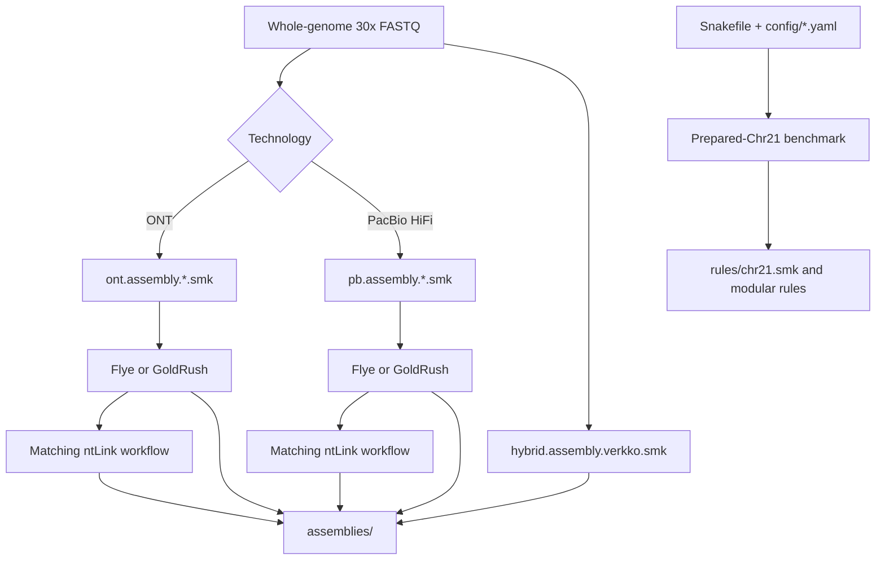

# Long-Read Assembly Workflows

This directory contains Snakemake workflows for assembling whole-genome ONT
and PacBio long-read data with Flye, GoldRush, ntLink, and Verkko.

Production whole-genome assembly uses the technology-specific workflows under
`assemblers/whole_genome_asm/`. The modular `assemblers/Snakefile` is retained
for prepared-Chr21 benchmarking and local validation.

## Workflow map



## File organization

```text
assemblers/
├── Snakefile                  # Primary entry point
├── samples.tsv                # Sample and technology metadata
├── config/
│   ├── base.yaml              # Shared workflow defaults
│   ├── local.yaml             # Local test/prepared-read settings
│   └── server.yaml            # Server whole-genome settings
├── rules/
│   ├── common.smk             # Paths, samples, resources, targets
│   ├── validation.smk         # Input and Docker validation
│   ├── chr21.smk              # Whole-genome to Chr21 preprocessing
│   ├── flye.smk
│   ├── goldrush.smk
│   ├── ntlink.smk
│   ├── verkko.smk
│   └── assessment.smk
├── scripts/chr21/             # Filtering and normalization scripts
└── containers/                # Dockerfiles and image build helpers
```

`Snakefile` loads `config/base.yaml`, then includes `rules/common.smk` and the
rule modules. A file supplied with `--configfiles` overrides values from
`base.yaml`. `samples.tsv` contains metadata only.

## Samples

```text
sample  technology
HG002   ont
HG002   pb
HG003   ont
HG003   pb
HG004   ont
HG004   pb
```

Use `ont` for Oxford Nanopore and `pb` for PacBio HiFi. Verkko requires both
technologies for each sample. Do not put absolute paths in this file.

## Production input: whole-genome 30x FASTQs

The production target is whole-genome assembly from the server's 30x FASTQ
files. The production workflow passes complete whole-genome FASTQs to Flye,
GoldRush, ntLink, and Verkko; it does not assemble only chromosome 21.

The expected server input layout is:

```text
input_root/
├── HG002.ont.30x.fastq.gz
├── HG002.pb.30x.fastq.gz
├── HG003.ont.30x.fastq.gz
├── HG003.pb.30x.fastq.gz
├── HG004.ont.30x.fastq.gz
└── HG004.pb.30x.fastq.gz
```

The production standalone workflows under `whole_genome_asm/` discover these
files from `fastq/` using `fastq/{dataset}.fastq.gz`. They select `.ont.` or
`.pb.` datasets and exclude `.1k`, `.chr21`, and `.localtest` test inputs.

## Local test inputs

Local reduced datasets are test fixtures, not production inputs. The repository
may contain:

```text
fastq/
├── HG002SMOKE.ont.30x.fastq.gz  # Small ONT smoke input
├── HG002SMOKE.pb.30x.fastq.gz   # Small PacBio smoke input
├── HG002.ont.1k.fastq.gz        # Small 1k-read test input
├── HG002.pb.1k.fastq.gz         # Small 1k-read test input
└── *chr21*.fastq.gz             # Prepared Chr21 test inputs
```

Smoke, 1k, and Chr21 files are useful for checking Snakemake wiring, Docker
invocation, input conversion, and short tool runs. They are not representative
of a human whole-genome assembly and may fail tools configured for a 3 Gb
genome because those tools can allocate substantial memory.

The active modular workflow's `config/local.yaml` is configured for prepared
Chr21 testing. It is a local validation profile, not the production WGS
profile.

## Input modes

### Local prepared-Chr21 mode

`config/local.yaml` uses `input_mode: "chr21_fastq"`. Its `input_root` must
contain already normalized inputs such as:

```text
input_root/
├── HG002/HG002.ont.chr21.primary.mapq20.30x.fastq.gz
├── HG002/HG002.hifi.chr21.primary.mapq20.30x.fastq.gz
└── ...
```

No mapping or extraction is performed in this mode.

### Server whole-genome mode

Edit `config/server.yaml` with the real paths:

```yaml
input_mode: "whole_genome"
input_root: "/server/path/to/fastq"
reference: "/server/path/to/GRCh38.fa"
whole_genome_pattern: "{sample}.{technology}.30x.fastq.gz"
```

The default input layout is:

```text
input_root/
├── HG002.ont.30x.fastq.gz
├── HG002.pb.30x.fastq.gz
├── HG003.ont.30x.fastq.gz
├── HG003.pb.30x.fastq.gz
├── HG004.ont.30x.fastq.gz
└── HG004.pb.30x.fastq.gz
```

For sample subdirectories, use for example:

```yaml
whole_genome_pattern: "{sample}/{sample}.{technology}.fastq.gz"
```

Whole-genome mode in the modular workflow is a Chr21 preprocessing mode: it
maps reads to the reference and produces normalized Chr21 inputs under
`results/chr21/` before assembly. It is intended for the prepared-Chr21
benchmark. Production whole-genome assembly should use the standalone
workflows in `whole_genome_asm/`, which pass WGS FASTQs directly to the
assemblers. The reference should use the expected chromosome name, normally
`chr21` for GRCh38.

## Outputs

```text
results/
├── chr21/                  # Normalized inputs in whole-genome mode
├── flye/{sample}.{technology}.fasta
├── goldrush/{sample}.{technology}.fasta
├── ntlink/{sample}.{technology}.fasta
├── verkko/{sample}.fasta
├── work/                   # Tool working directories
├── logs/                   # Validation and tool logs
└── progress/               # Completion and failure markers
```

ntLink uses the matching GoldRush assembly as its draft. Verkko combines ONT
and PacBio reads from each sample.

## Prerequisites

```bash
command -v python3
command -v snakemake
command -v docker
command -v minimap2
command -v samtools
docker info
```

The assembler rules use Docker. GoldRush and Flye require substantial memory;
the supplied server configuration assigns up to 64 GB per such job.

## Running the workflow

Run from the `assemblers/` directory:

```bash
cd /path/to/lrs_benchmarking_wgs_clean/assemblers
```

Inspect local prepared-Chr21 test inputs:

```bash
snakemake --snakefile Snakefile \
  --configfiles config/local.yaml \
  --cores 4 --resources mem_mb=12000 \
  --dry-run --printshellcmds
```

Inspect the modular server Chr21-preprocessing DAG after setting the reference:

```bash
snakemake --snakefile Snakefile \
  --configfiles config/server.yaml \
  --cores 128 --resources mem_mb=240000 \
  --dry-run --printshellcmds
```

Check that the displayed paths match the server before running jobs. This is
the modular Chr21-preprocessing workflow, not direct WGS assembly. Test one
modular assembly first:

```bash
snakemake --snakefile Snakefile results/flye/HG002.ont.fasta \
  --configfiles config/server.yaml \
  --cores 32 --resources mem_mb=64000 \
  --rerun-incomplete --printshellcmds
```

Then run all assemblers selected in `config/base.yaml`:

```bash
snakemake --snakefile Snakefile \
  --configfiles config/server.yaml \
  --cores 128 --resources mem_mb=240000 \
  --rerun-incomplete --printshellcmds
```

Use `config/local.yaml` instead of `config/server.yaml` for prepared local
Chr21 inputs.

## Running production whole-genome assemblers

Run these standalone workflows from the repository root, not from
`assemblers/`. They use `CWD` from `header_assembler.smk`, so the current
directory must contain `fastq/`:

```bash
cd /path/to/lrs_benchmarking_wgs_clean
```

These production workflows use the server's complete whole-genome 30x FASTQs
directly. They do not use `config/server.yaml`, do not extract Chr21, and do
not require a reference FASTA.

### Flye

Run ONT and PacBio independently:

```bash
snakemake --snakefile assemblers/whole_genome_asm/ont.assembly.flye2.smk \
  --cores 32 --resources mem_gb=450 \
  --rerun-incomplete --printshellcmds

snakemake --snakefile assemblers/whole_genome_asm/pb.assembly.flye2.smk \
  --cores 32 --resources mem_gb=450 \
  --rerun-incomplete --printshellcmds
```

To run one dataset only, use its absolute output path because the workflows
define outputs with `CWD`:

```bash
snakemake --snakefile assemblers/whole_genome_asm/ont.assembly.flye2.smk \
  "$PWD/assemblies/flye/HG002.ont.30x/assembly.fasta" \
  --cores 32 --resources mem_gb=450 \
  --rerun-incomplete --printshellcmds
```

### GoldRush

Run ONT and PacBio independently:

```bash
snakemake --snakefile assemblers/whole_genome_asm/ont.assembly.Goldrush.smk \
  --cores 32 --resources mem_mb=64000 \
  --rerun-incomplete --printshellcmds

snakemake --snakefile assemblers/whole_genome_asm/pb.assembly.Goldrush.smk \
  --cores 32 --resources mem_mb=64000 \
  --rerun-incomplete --printshellcmds
```

GoldRush uses the patched
`nicolasardila1/lrs-goldrush:1.2.2-ntlinkfix` image. It requires substantial
memory and should run on the server rather than on a small workstation.

### ntLink

ntLink uses the matching GoldRush assembly as its draft. Run the matching
technology-specific workflow after GoldRush succeeds:

```bash
snakemake --snakefile assemblers/whole_genome_asm/ont.assembly.ntlink.smk \
  --cores 16 --resources mem_mb=32000 \
  --rerun-incomplete --printshellcmds

snakemake --snakefile assemblers/whole_genome_asm/pb.assembly.ntlink.smk \
  --cores 16 --resources mem_mb=32000 \
  --rerun-incomplete --printshellcmds
```

For example, the ONT ntLink workflow consumes:

```text
assemblies/goldrush/HG002.ont.30x/assembly.fasta
fastq/HG002.ont.30x.fastq.gz
```

and writes:

```text
assemblies/ntlink/HG002.ont.30x/assembly.fasta
```

### Verkko

Verkko is a hybrid assembler and runs one sample at a time using both
technologies:

```bash
snakemake --snakefile assemblers/whole_genome_asm/hybrid.assembly.verkko.smk \
  --cores 32 --resources mem_mb=72000 \
  --rerun-incomplete --printshellcmds
```

For one sample, use for example:

```bash
snakemake --snakefile assemblers/whole_genome_asm/hybrid.assembly.verkko.smk \
  "$PWD/assemblies/verkko/HG002/assembly.fasta" \
  --cores 32 --resources mem_mb=72000 \
  --rerun-incomplete --printshellcmds
```

Verkko requires both files to exist:

```text
fastq/HG002.ont.30x.fastq.gz
fastq/HG002.pb.30x.fastq.gz
```

### Server dry-runs

Before executing a production job, run the selected workflow with `--dry-run`.
The dry-run must show the expected whole-genome FASTQ paths and no Chr21
preprocessing rules:

```bash
snakemake --snakefile assemblers/whole_genome_asm/ont.assembly.flye2.smk \
  --dry-run --printshellcmds
```

The local `HG002SMOKE`, `1k`, and Chr21 files can be used for wiring tests, but
they are not substitutes for the server's whole-genome 30x datasets.

## GoldRush and ntLink

GoldRush uses `nicolasardila1/lrs-goldrush:1.2.2-ntlinkfix`. The image includes
the plain-FASTQ compatibility fix and a guard for empty ntLink checkpoint
mappings. The GoldRush rules remove stale `*.verbose_mapping.tsv` files after
interrupted runs so ntLink regenerates its mappings.

## Legacy workflows

Files under `whole_genome_asm/` are older standalone workflows modelled on the
upstream repository. For example, `ont.assembly.flye2.smk` includes
`header_assembler.smk`, gets `CWD` from `os.getcwd()`, discovers
`fastq/{dataset}.fastq.gz`, and writes to `assemblies/flye/{dataset}/`.

These standalone files do not use `config/base.yaml`, the local/server config
files, or `samples.tsv`. The standalone GoldRush ONT and PB workflows likewise
use CWD-based paths and hard-coded settings. They are retained for historical
or isolated testing and must not be mixed with the modular `Snakefile`.

`benchmark_chr21_real/` is a separate workflow with its own Snakefile, config,
sample sheet, and output tree.

The upstream repository is therefore a useful reference for the original
one-`.smk`-file-per-tool style, while this directory's modular workflow is the
recommended centralized implementation.
